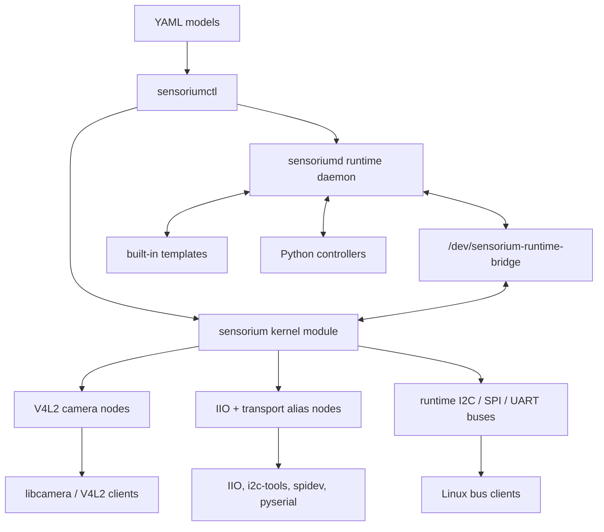

# Sensorium

Virtual sensors for real Linux clients.

[](LICENSE)


Sensorium is a Linux-facing virtual sensor stack. It lets camera, IIO, I2C,
SPI, and UART consumers talk to simulated devices through normal Linux device
interfaces.

It is built for interface fidelity: media graphs, V4L2 nodes, IIO devices,
`i2c-dev`, `spidev`, tty ports, daemon-backed runtime buses, and model-driven
configuration. It is not a cycle-accurate hardware emulator.

> License notice: Sensorium is source-available for non-commercial use only
> under the PolyForm Noncommercial License 1.0.0. Commercial use requires a
> separate commercial license from the project owner.

## Contents

- [What You Get](#what-you-get)
- [Who It's For](#who-its-for)
- [Architecture](#architecture)
- [Project Status](#project-status)
- [Operational Requirements](#operational-requirements)
- [Quick Start](#quick-start)
- [Install to First Success](#install-to-first-success)
- [Python Runtime Example](#python-runtime-example)
- [API Stability](#api-stability)
- [Support and Evidence](#support-and-evidence)
- [Validation](#validation)
- [Packaging](#packaging)
- [Documentation](#documentation)

## What You Get

| Surface | What it exposes | Typical use |
| --- | --- | --- |
| Camera | V4L2/media-controller camera graph with Sony IMX-style profiles | libcamera and camera-client validation |
| IIO | Simple environmental sensor models over `i2c`, `spi`, or `uart`-shaped aliases | Linux sensor stack smoke tests |
| Runtime I2C | Multi-device `i2c-N` adapter with template or controller-backed targets | `i2c-tools`, `I2C_RDWR`, driver/client tests |
| Runtime SPI | `spidevB.C` devices with per-device mode, word size, speed, and scripted replies | SPI userspace and protocol testing |
| Runtime UART | tty-style ports such as `ttyAMA0` with echo, line, binary, and modem behavior | serial clients and controller loops |
| Python runtime | `sensorium.runtime.client` plus controller examples | custom simulated devices |

Sensorium ships as an out-of-tree kernel module named `sensorium`, a runtime
daemon named `sensoriumd`, a control CLI named `sensoriumctl`, YAML models, and
packaging metadata for distribution-oriented installs.

## Who It's For

Sensorium is a good fit when you need repeatable Linux device surfaces without
physical hardware on every test machine.

| Use Sensorium for | Do not use Sensorium for |
| --- | --- |
| validating camera, IIO, I2C, SPI, or UART clients | proving analog or electrical behavior |
| CI, QEMU, remote lab, and controlled-host regression | cycle-accurate bus or sensor timing |
| scripted device behavior with YAML models | replacing a real hardware qualification lab |
| custom simulated devices in Python | hostile multi-tenant device isolation |
| packaging the simulator onto new Linux machines | claiming full physical sensor emulation |

## Architecture



Camera and IIO models are module configurations. Runtime models are live
daemon-managed inventories, so one runtime model can expose many I2C targets,
SPI chip selects, and UART ports at once.

## Project Status

Sensorium is ready for controlled validation environments where you own the
host, kernel headers, and deployment flow. The strongest paths today are:

- model-driven camera, IIO, I2C, SPI, and UART simulation
- daemon-backed runtime buses with multiple devices per model
- Python template/controller workflows for custom simulated behavior
- packaged release artifacts for installing on new machines
- QEMU and remote-host validation workflows for release evidence

Sensorium is intentionally not a physical sensor emulator. Electrical behavior,
cycle timing, exact silicon internals, and full hardware bus fidelity are out
of scope. The camera path also does not include a custom libcamera pipeline
handler; it targets Linux-facing discovery and capture behavior through the
kernel module and repo-side runtime/tuning configuration.

## Operational Requirements

Sensorium is a kernel-module project, so successful deployment needs:

- root privileges for module load/unload, DKMS, and systemd operations
- matching kernel headers or an explicit `KDIR=/path/to/linux/build`
- a controlled host where Sensorium can own `/run/sensorium`,
  `/var/lib/sensorium`, and the simulated device surfaces
- Secure Boot/module-signing handling if the target host enforces signed
  out-of-tree modules
- optional validation tools such as libcamera, v4l-utils, ffmpeg, i2c-tools,
  pyserial, QEMU, and Ansible depending on the workflow

The production model is a trusted validation host, not hostile multi-tenant
isolation. See [docs/production.md](docs/production.md) for service and state
directory assumptions.

## Quick Start

Choose the path that matches what you are doing:

| Path | Start here |
| --- | --- |
| Source checkout development | `./scripts/local/install-deps-ubuntu.sh --profile full` |
| Runtime-only host | `./scripts/local/install-deps-ubuntu.sh --profile runtime` |
| Packaged install test | `make package-deb` then install `dist/deb/*.deb` |
| QEMU validation | `make qemu-ci-smoke` or `make qemu-e2e` |
| Kernel-major-7 evidence path | `make qemu-linux7-ci-smoke` or `make qemu-linux7-e2e` |

Install the smallest dependency set for module build/load:

```bash
./scripts/local/install-deps-ubuntu.sh --profile driver
```

Install runtime or full validation dependencies when needed:

```bash
./scripts/local/install-deps-ubuntu.sh --profile runtime
./scripts/local/install-deps-ubuntu.sh --profile full
./scripts/local/install-deps-ubuntu.sh --profile full --ops
```

Build the module against a prepared kernel tree:

```bash
make module KDIR=/path/to/linux/build
```

Run the fast source-tree loop:

```bash
./scripts/local/prepare-wsl-kernel-tree.sh
./scripts/runtime/reload-sensorium.sh
./scripts/local/verify-libcamera-detect.sh
```

Apply example models:

```bash
./scripts/runtime/sensoriumctl list
./scripts/runtime/sensoriumctl apply ./models/camera/imx708.yaml
./scripts/runtime/sensoriumctl apply ./models/iio/environment-i2c.yaml
./scripts/runtime/sensoriumctl daemon start
./scripts/runtime/sensoriumctl runtime apply ./models/runtime/rpi-multibus.yaml
```

Inspect the live runtime:

```bash
./scripts/runtime/sensoriumctl runtime status
./scripts/runtime/sensoriumctl runtime health
./scripts/runtime/sensoriumctl runtime buses
./scripts/runtime/sensoriumctl runtime devices
./scripts/runtime/sensoriumctl runtime trace --limit 8
```

Expected shape after applying `models/runtime/rpi-multibus.yaml`:

```text
$ ./scripts/runtime/sensoriumctl runtime buses
i2c-main: i2c -> i2c-1
spi-main: spi -> spi0
uart-main: uart -> uart0

$ ./scripts/runtime/sensoriumctl runtime devices
env-bme280: i2c on i2c-main [template] addr=0x76
env-bme680: i2c on i2c-main [template] addr=0x77
flash-spi: spi on spi-main [template] node=spidev0.0
aux-spi: spi on spi-main [template] node=spidev0.1
console-uart: uart on uart-main [template] node=ttyAMA0
aux-uart: uart on uart-main [template] node=ttyAMA1
```

## Install to First Success

For a new Debian/Ubuntu-style target host, build the package, install it, apply
the runtime model, and confirm that Linux-facing buses/devices are visible:

```bash
make package-deb
sudo apt install ./dist/deb/sensorium-dkms_$(cat VERSION)_all.deb

sudo sensoriumctl runtime apply /usr/share/sensorium/models/runtime/rpi-multibus.yaml
sudo sensoriumctl runtime status
sudo sensoriumctl runtime buses
sudo sensoriumctl runtime devices
```

The package installs a systemd unit for `sensoriumd`. `sensoriumctl runtime
apply` loads the runtime module and starts/adopts the daemon for the current
model. Enable the unit only when your deployment also loads/applies the runtime
module before expecting the daemon to stay up after boot:

```bash
sudo systemctl enable sensoriumd
sudo systemctl status sensoriumd
```

If DKMS cannot build the module, check that the target has matching kernel
headers or set `KDIR` to a prepared kernel build tree before installing.

## Models

Models live under:

```text
models/camera/
models/iio/
models/runtime/
```

The public model contract is:

```bash
./scripts/runtime/sensoriumctl apply ./models/camera/imx708.yaml
./scripts/runtime/sensoriumctl apply ./models/iio/environment-spi.yaml
./scripts/runtime/sensoriumctl runtime apply ./models/runtime/rpi-multibus.yaml
```

Runtime model examples include:

- `models/runtime/rpi-multibus.yaml`: two I2C targets, two SPI devices, and two
  UART ports
- `models/runtime/rpi-managed-workers.yaml`: broker-managed Python controller
  workers
- `models/runtime/rpi-multibus-scale.yaml`: larger I2C/SPI/UART fan-out
- `models/runtime/rpi-multibus-burnin.yaml`: stress-oriented runtime inventory
- `models/runtime/rpi-sparse-uart.yaml`: high-index tty validation

List the camera profile catalog:

```bash
./scripts/runtime/list-sensorium-sensors.sh
```

## Python Runtime Example

Packaged installs expose `/usr/share/sensorium/src` on Python's import path.
Source checkouts can use `PYTHONPATH=src`.

This example creates one I2C register-bank sensor, one SPI ID-response device,
and one UART command-response device:

```python
from sensorium.runtime.client import SensoriumRuntimeClient

model = {
    "name": "python-transport-demo",
    "schema_version": 2,
    "adapter": "runtime",
    "runtime": {
        "buses": [
            {"id": "i2c-main", "transport": "i2c", "name": "i2c-1"},
            {"id": "spi-main", "transport": "spi", "name": "spi0"},
            {"id": "uart-main", "transport": "uart", "name": "uart0"},
        ],
        "devices": [
            {
                "id": "temp-i2c",
                "bus": "i2c-main",
                "transport": "i2c",
                "address": 0x48,
                "backend": {
                    "kind": "template",
                    "template": "i2c-register-bank",
                    "registers": {0x00: 0x21, 0x01: 0x80},
                },
            },
            {
                "id": "id-spi",
                "bus": "spi-main",
                "transport": "spi",
                "chip_select": 0,
                "device_name": "spidev0.0",
                "settings": {
                    "mode": 0,
                    "bits_per_word": 8,
                    "max_speed_hz": 500000,
                },
                "backend": {
                    "kind": "template",
                    "template": "spi-script",
                    "prefix_responses": {"9f": "ef4018"},
                    "default_response": "",
                    "echo": True,
                },
            },
            {
                "id": "console-uart",
                "bus": "uart-main",
                "transport": "uart",
                "port_name": "ttyAMA0",
                "settings": {
                    "baud_rate": 115200,
                    "data_bits": 8,
                    "parity": "none",
                },
                "backend": {
                    "kind": "template",
                    "template": "uart-script",
                    "line_responses": {"AT": "OK\r\n"},
                    "echo": True,
                },
            },
        ],
    },
}

client = SensoriumRuntimeClient()
client.apply_model_data(model)
print(client.list_devices())
```

After applying the model, normal Linux software can talk to `/dev/i2c-1`,
`/dev/spidev0.0`, and `/dev/ttyAMA0`.

For behavior that does not fit a template, declare the device with
`backend: {"kind": "controller"}` and attach a Python controller:

```yaml
name: python-controller-demo
schema_version: 2
adapter: runtime
runtime:
  buses:
    - id: i2c-main
      transport: i2c
      name: i2c-1
  devices:
    - id: controller-i2c
      bus: i2c-main
      transport: i2c
      address: 0x49
      backend:
        kind: controller
```

```python
from sensorium.runtime.client import SensoriumRuntimeClient

session = SensoriumRuntimeClient().controller("my-controller")
session.attach(["controller-i2c"])

while True:
    event = session.next_event(timeout=30.0)
    if event is None:
        session.heartbeat()
        continue
    if event.transport == "i2c":
        session.reply_ok(event, data="42")
    else:
        session.reply_error(event, status=-95)
```

Complete controller examples:

- `scripts/runtime/runtime-controller-eeprom.py`
- `scripts/runtime/runtime-controller-spi-flash.py`
- `scripts/runtime/runtime-controller-uart-mcu.py`

## API Stability

| Surface | Stability |
| --- | --- |
| `sensoriumctl` and `sensoriumd` | public runtime CLI/daemon surface |
| YAML models under `models/` | public model format; current runtime schema is `schema_version: 2` |
| `sensorium.runtime.client.SensoriumRuntimeClient` | public Python controller/client entrypoint |
| `scripts/runtime/*` | packaged runtime entrypoints |
| Debian DKMS package layout | release packaging surface |
| `scripts/local`, `scripts/remote`, `scripts/qemu`, `scripts/benchmarks` | supported source-tree workflows, not installed runtime APIs |
| `src/sensorium/runtime/*` internals and kernel/daemon bridge details | internal implementation unless documented in ABI/runtime bridge docs |

The live runtime bridge contract is documented in
[docs/runtime-bridge-v5.md](docs/runtime-bridge-v5.md). Treat older bridge
documents as historical context.

## Support and Evidence

### Platform Matrix

| Platform / workflow | Status | Evidence command | Notes |
| --- | --- | --- | --- |
| Debian trixie QEMU genericcloud | primary VM validation path | `make qemu-ci-smoke`, `make qemu-e2e` | recent evidence includes kernel `6.12.74+deb13+1-cloud-amd64` |
| Debian trixie QEMU with sid media kernel | explicit kernel-major-7 path | `make qemu-linux7-ci-smoke`, `make qemu-linux7-e2e` | latest full e2e evidence used `7.0.4+deb14-amd64` |
| Debian QEMU benchmark guest | benchmark/performance evidence | `make benchmark`, `make benchmark-matrix` | recent artifact used `6.19.12+deb14-amd64` |
| Debian/Ubuntu controlled remote host | supported release workflow | `./scripts/remote/remote-regression.sh` | exact kernel is host-specific; record it for each release |
| Debian/Ubuntu packaged target | supported install path when DKMS can build | `make package-deb`, then install `dist/deb/*.deb` | requires matching headers or explicit `KDIR` |
| WSL2 development host | development and repo-check path | `make check` | recent host kernel was `6.6.87.2-microsoft-standard-WSL2`; module builds require a prepared WSL kernel tree |
| Arch / Alpine package metadata | packaging metadata path | `make package-meta` | metadata is rendered; install validation is per target release |
| Secure Boot enforcing unsigned modules | conditional | site-specific module signing | Sensorium does not bypass host module-signing policy |
| hostile multi-tenant hosts | not a target | none | production model assumes a trusted validation host |

### Tested Kernels

These are recent validation evidence points, not an exclusive compatibility
range. Record the exact kernel again for every release.

| Kernel | Environment | Evidence |
| --- | --- | --- |
| `7.0.4+deb14-amd64` | Debian trixie QEMU guest with Debian sid media kernel stream | full `make qemu-linux7-e2e` release validation run on 2026-05-09 |
| `6.12.74+deb13+1-cloud-amd64` | Debian trixie genericcloud QEMU guest | QEMU boot/e2e evidence from release validation |
| `6.19.12+deb14-amd64` | Debian QEMU benchmark guest | QEMU benchmark artifact recorded on 2026-04-17 |
| `6.6.87.2-microsoft-standard-WSL2` | WSL2 development host | repo-level `make check` on 2026-05-09; not module-load evidence |

The Linux-major-7 targets currently assert that the guest boots a kernel with
major version `7`; the most recent full e2e run used `7.0.4+deb14-amd64`.

## Validation

Fast local checks:

```bash
make test
make check
```

Release checks:

```bash
CHECK_QEMU_SMOKE=0 CHECK_BENCHMARK_REGRESSIONS=0 make check-release
make dist package-deb package-meta
```

QEMU gates:

```bash
make qemu-ci-smoke
make qemu-e2e
make qemu-linux7-ci-smoke
make qemu-linux7-e2e
```

`make qemu-linux7-e2e` currently configures a Debian trixie guest with the
Debian sid media kernel stream and requires `uname -r` to report kernel major
`7`. The most recent full e2e evidence used `7.0.4+deb14-amd64`.

Remote host gates:

```bash
./scripts/remote/provision-droplet.sh
./scripts/remote/remote-regression.sh
./scripts/remote/remote-benchmark-matrix.sh
```

Production baseline checks:

```bash
./scripts/local/check-production-host-baseline.sh --profile runtime
./scripts/local/check-production-host-baseline.sh --profile full --strict
```

Benchmark artifacts default to `.cache/benchmarks/` unless
`SENSORIUM_BENCHMARK_DIR` is set. Missing baselines are allowed by default;
set `BENCHMARK_REQUIRE_BASELINE=1` when a benchmark-regression gate must fail
without a baseline.

Release evidence should record the host, exact kernel, libcamera version when
camera paths are involved, command, git revision, dirty state, and result. The
release checklist in [docs/production.md](docs/production.md) has the fuller
matrix.

Minimum release evidence matrix:

| Evidence | Command | Required |
| --- | --- | --- |
| Repo hygiene and unit tests | `make check` and `make test` | every release |
| Source package | `make dist` | every release |
| Debian package | `make package-deb` and inspect package contents | every release |
| Arch/Alpine metadata | `make package-meta` | every release |
| Clean release profile | `make check-release` from a clean tree | every release |
| QEMU smoke/e2e | `make qemu-ci-smoke` or `make qemu-e2e` | when claiming VM support |
| Kernel-major-7 evidence | `make qemu-linux7-ci-smoke` or `make qemu-linux7-e2e` | when claiming current kernel-7 support |
| Remote controlled host | `./scripts/remote/remote-regression.sh` | when claiming remote-host support |
| Benchmark evidence | `make benchmark-matrix` or remote equivalent | performance-sensitive releases |
| Fresh target install | install `dist/deb/*.deb`, apply runtime model, list devices | distribution releases |

## Packaging

Build release artifacts:

```bash
make dist
make package-deb
make package-meta
```

Install the Debian package on a target host:

```bash
sudo apt install ./dist/deb/sensorium-dkms_$(cat VERSION)_all.deb
```

The Debian package installs the runtime-facing surface:

- the DKMS kernel module source
- `sensoriumctl` and `sensoriumd`
- `scripts/runtime/`
- `scripts/lib/sensorium-common.sh`
- `src/sensorium/`
- YAML models
- systemd unit files and examples
- Python import hook for `/usr/share/sensorium/src`

Source-tree validation, QEMU, remote, benchmark, and package-build scripts stay
in the source tree. They are intentionally not part of the runtime package
surface.

## Common Workflows

Camera stream helper:

```bash
./scripts/runtime/stream-url-to-sensorium.sh ./input.mp4
```

Remote sync and smoke:

```bash
cp .env.remote.example .env.remote
./scripts/remote/remote-sync.sh
./scripts/remote/remote-reload.sh
./scripts/remote/remote-verify.sh
```

Runtime stress:

```bash
./scripts/local/stress-runtime-model.sh ./models/runtime/rpi-multibus-scale.yaml 3
./scripts/remote/remote-stress-runtime.sh models/runtime/rpi-multibus-burnin.yaml 5
```

Manual QEMU access:

```bash
./scripts/qemu/qemu-start.sh
./scripts/qemu/qemu-wait.sh
./scripts/qemu/qemu-ssh.sh 'uname -a'
./scripts/qemu/qemu-stop.sh
```

## Repository Layout

```text
kernel/     out-of-tree kernel module
src/        Python runtime library, CLI, controllers, and tools
scripts/    runtime, local, remote, QEMU, benchmark, and packaging entrypoints
models/     camera, IIO, and runtime YAML models
packaging/  Debian DKMS, systemd, Arch, Alpine, and Python metadata
config/     IPA/tuning files used by validation flows
tools/      small libcamera and conversion helpers
docs/       architecture, ABI, release, script, testing, and production notes
ansible/    controlled remote/QEMU host provisioning
```

The root of `scripts/` should contain category directories only. See
[docs/scripts.md](docs/scripts.md) for the script catalog and package surface.

## Documentation

- [Architecture](docs/architecture.md)
- [ABI Notes](docs/abi.md)
- [Runtime Bridge v5](docs/runtime-bridge-v5.md)
- [Production Deployment](docs/production.md)
- [Testing Guide](docs/testing.md)
- [Script Catalog](docs/scripts.md)
- [Profile Catalog](docs/profile-catalog.md)
- [Troubleshooting](docs/troubleshooting.md)
- [Releasing](docs/releasing.md)
- [Roadmap](docs/roadmap.md)
- [Changelog](CHANGELOG.md)
- [Contributing](CONTRIBUTING.md)
- [Security](SECURITY.md)

## License

This repository is licensed for non-commercial use only under the PolyForm
Noncommercial License 1.0.0. See [LICENSE](LICENSE) for the full terms.

Allowed use under the repository license includes non-commercial research,
testing, evaluation, education, hobby work, and other non-commercial purposes
covered by the license.

Commercial use, commercial redistribution, commercial product integration,
hosted commercial services, or use for a commercial customer's benefit requires
a separate commercial license from the project owner.

The Linux kernel module keeps `MODULE_LICENSE("GPL")` as a kernel loader and
GPL-only-symbol compatibility declaration. That kernel metadata does not replace
the repository-level PolyForm Noncommercial license for this project.
